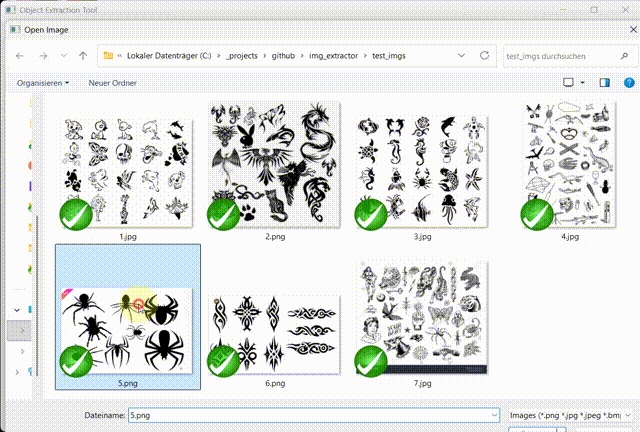
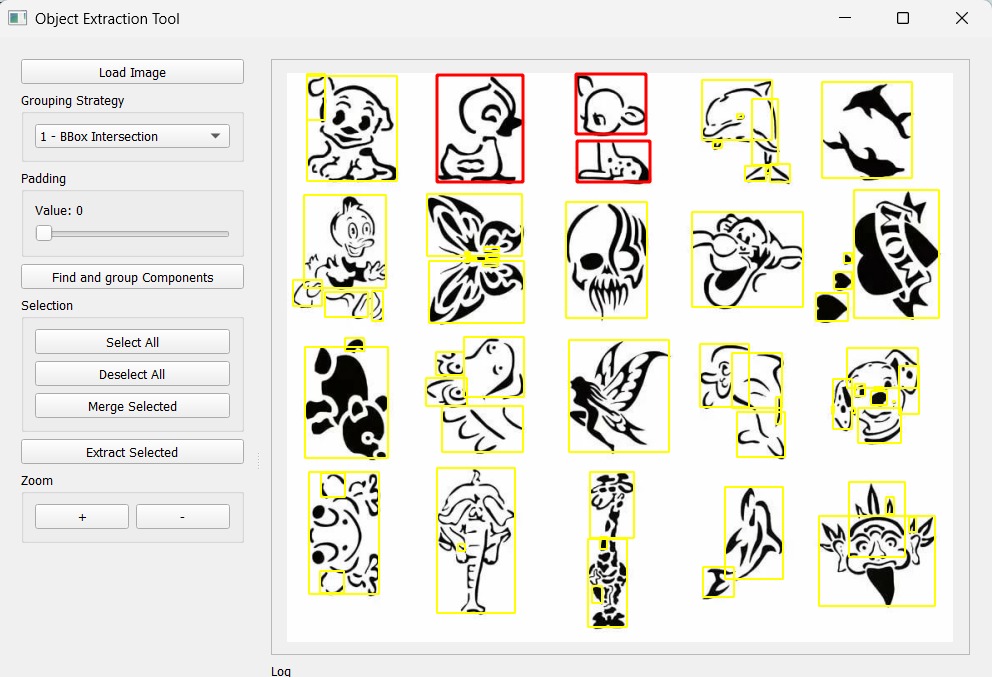

# Object Extraction Tool

### Interactive & Scriptable Image Segmentation Using Geometric Grouping



## Overview

**Object Extraction Tool** is a Python-based application that automatically detects, groups, and extracts black objects from images with white backgrounds.
It provides:

* A **command-line tool** for automated batch processing
* A **full GUI** (PyQt5) for interactive selection, merging, and exporting
* Multiple **geometric grouping strategies**
* Transparent PNG export using mask-based extraction
* Optional merging and lasso–based multi-selection

The tool is designed for use cases such as tattoo sheet segmentation, logo extraction, scanned art processing, and any scenario where multiple black shapes must be isolated automatically.

---

## Features

### 🖼️ Image Processing Pipeline

* Grayscale conversion & binary segmentation
* Connected-component detection
* Convex-hull calculation (Shapely)
* Bounding box & mask extraction
* Transparent PNG export

### 🧠 Grouping Strategies (0–4)

Objects may overlap or belong together. To handle this, the tool offers five grouping modes:

| Strategy | Name                      | Description                                      |
| -------- | ------------------------- | ------------------------------------------------ |
| **0**    | No Grouping               | Treat each component independently               |
| **1**    | BBox Intersection         | Groups components whose bounding boxes intersect |
| **2**    | BBox–Hull Intersection    | Intersects expanded bbox with convex hull        |
| **3**    | Hull–Hull Intersection    | Uses convex hull intersection for grouping       |
| **4**    | Dilated Mask Intersection | Pixel-accurate grouping using mask dilation      |

### 🧩 GUI Features

* Adjustable **padding** (0–20 px)
* Zooming & panning
* Click or **lasso selection**
* Merge selected groups
* Extract selected objects individually
* Automatic generation of unique filenames
* Real-time bounding-box visualization

---

## Installation

### Requirements

Python 3.8+ is recommended.

```
pip install numpy opencv-python shapely PyQt5
```

### Project Structure

```
.
├── img_extractor.py          # Command-line extractor
├── img_extractor_gui.py      # Full GUI application
├── imgs/1.png                # Example screenshot
└── README.md
```

---

## Usage

## 1. Command-Line Tool

Run:

```
python img_extractor.py <input_image>
```

Useful options:

```
python img_extractor.py image.png --strategy 3 --padding 12 --debug
```

### Command-Line Arguments

| Argument         | Description                         |
| ---------------- | ----------------------------------- |
| `input_file`     | Path to the image                   |
| `-s, --strategy` | Grouping strategy (0–4), default: 1 |
| `-p, --padding`  | Expansion padding in pixels         |
| `--debug`        | Enable detailed output              |

Extracted objects are saved to a folder named after the input file (e.g., `image/`).

---

## 2. GUI Application

Start the GUI:

```
python img_extractor_gui.py
```

### GUI Workflow

1. **Load Image**
2. Click **Find and Group Components**
3. Choose a **strategy** and **padding**
4. Select groups:

   * Click → toggle
   * Ctrl-click → add
   * **Lasso drag** → multi-select
5. **Merge Selected** (optional)
6. **Extract Selected** → exports PNGs with transparency
7. Process remaining elements again if needed

---

## How It Works

### Component Detection

The binary image is processed using OpenCV:

* `connectedComponentsWithStats`
* Contour extraction
* Convex hull computation
* Mask storage for accurate extraction

### Grouping

Grouping is performed through geometric relationships:

* Bounding-box tests
* Shapely polygons for hull intersection
* Mask dilation for pixel-level grouping
* Smart caching for speed

### Exporting

Each group becomes a transparent PNG:

* Cropped from original BGR image
* Converted to BGRA
* Mask applied to the alpha channel

---

## Example Output

After processing, extracted PNGs look like this:

```
output/
├── object_001.png
├── object_002.png
├── object_003.png
└── ...
```

Each file contains a clean cut-out with transparency.

---

## Known Limitations

* Only supports **black-on-white** images (no complex backgrounds)
* Very high resolutions may require increased padding
* Requires PyQt5 for GUI usage

---

## License

MIT License.
Feel free to use this tool in commercial or personal projects.

-----

[Watch on YouTube](https://youtu.be/yZQzde00p9E)